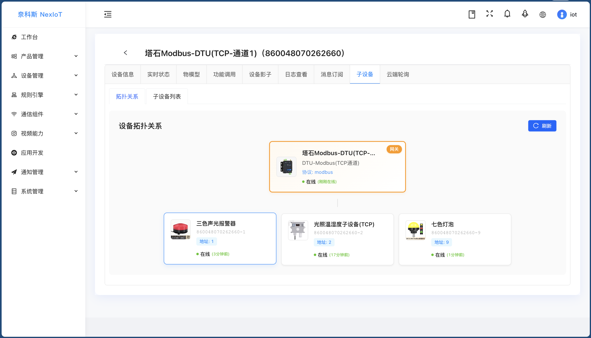
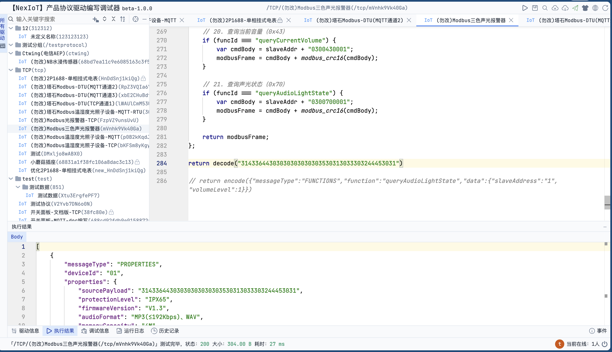
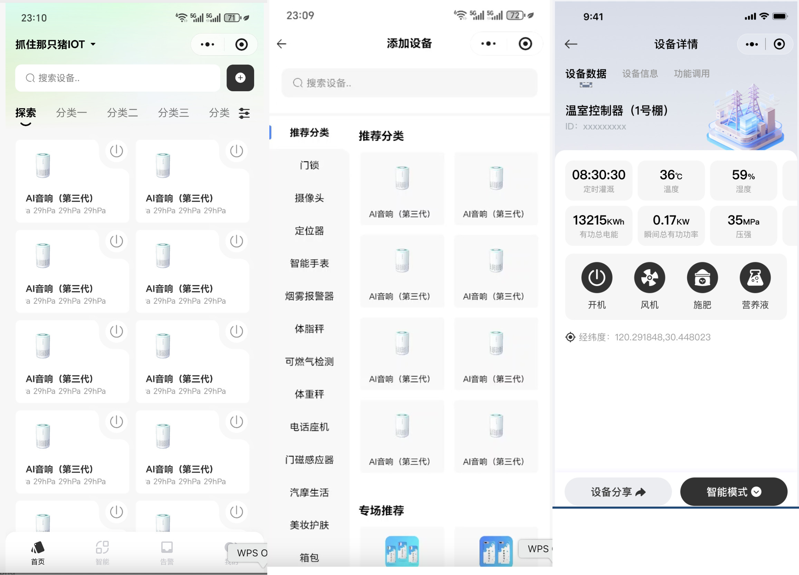

# 🤖 NexIoT AI物联网平台

## 🎯 创新的"真·零代码侵入"物联网平台

> **💡 突破传统物联网平台设计思路 · 设备驱动完全外置 · 一键导出即用 · 零代码侵入**

[📖 文档地址](https://nexiotplatform.github.io/universal-iot-docs/) | [🌐 在线演示](http://iot.192886.xyz:81/) | [🔧 AI调试IDE](http://iot.192886.xyz:81/magic/debug/index.html)

## ✨ 平台简介

**NexIoT AI物联网平台** 是一款采用创新架构设计的**真·零代码侵入**企业级物联网平台。

### 🎯 核心亮点

> **🚀 这个项目能为你做什么？**

- 🏢 **适合中大型企业**：***IoT基础能力中心，统一的设备数据接入***，想做自己产品的，做B｜G项目
- 🔓 **不再被卡脖子**：不再被某一个设备供应商、软件提供商卡脖子，漫天要价
- 🎓 **上手简单**：调试器上手简单，大学生就能上手，节省大量研发、测试、运维
- 🤝 **生态共建**：调试器给别人，让供应商来自主对接
- 📦 **一键导出**：产品、物模型、驱动内容，一键导出，生态共建共享
- ⚡ **实时热部署**：**实时热部署**生效，0款到100款设备对接，几年都不用重启服务
- 🚀 **高可用集群**：开源版支持集群，高可用，千百万设备，不再话下

## 🌟 平台亮点

- ✅ **设备驱动外置**：编解码逻辑在浏览器IDE中实现，与平台核心代码零耦合
- ✅ **一键导出**：产品物模型 + 设备驱动源码，打包导出直接注册使用
- ✅ **零代码侵入**：无需修改平台代码，无需重新编译部署，真正的零侵入
- ✅ **热插拔架构**：设备驱动在线热更新，新增设备类型零停机
- ✅ **可视化配置**：Web界面完成所有配置，基于浏览器的调试IDE
- ✅ **全协议支持**：Modbus RTU/TCP、MQTT、HTTP等工业协议和物联网协议
- ✅ **云平台对接**：天翼物联、移动OneNet等云平台集成
- ✅ **多数据库支持**：支持 **MySQL 8.0+**、**IoTDB**、**ClickHouse** 等时序数据库

## 🏗️ 技术架构

### 🛠️ 技术栈

#### 🚀 核心框架（极简轻量）

- **后端框架**：`Java 21` `SpringBoot 3.5` `Tk.Mybatis 5.0.1`
- **前端技术**：基于`RuoYi-Antdv`构建，感谢开源社区！

#### 💾 数据存储

- **关系数据库**：**MySQL 8.0+**
- **缓存系统**：**Redis 6.0+**
- **时序数据库**：**IoTDB** / **ClickHouse** / MySQL / None（产品级无感动态切换）

## 🧭 部署与启动（一键启动）

- **一键启动**：`docker-compose up -d`
- **访问地址**：
  - 后台 `http://localhost:80`（默认 `iot/IoTAbc2025001@`）
  - IDE调试器 `http://localhost:9092/magic/debug/index.html` (密码同后台）
  - EMQX 管理 `http://localhost:18083`（默认 `admin/public`）

## 📈 正在推进

### 🚀 近期规划（roadmap)

- **🚀 WVP视频平集成**：与WVP视频平台系列集成（内测中）
- **🚀 大华ICC系列产品**：与大华ICC产品系列集成
- **🚀 海康综合安防管理平台**：使用海康平台产品系列集成
- **📱 移动端应用**：付费图鸟定小程序，具备指令控制、属性、告警查看，轻量化、多管理员

### 🌟 长期愿景

- **🧠 深度学习**：设备行为学习、预测性维护、智能优化
- **🌐 生态建设**：插件市场、第三方集成、开发者社区
- **🏭 行业方案**：智能制造、智慧城市、智慧农业等垂直解决方案

## 🚀 快速开始

### 🎯 演示地址

> **✨ 全部真实设备，驱动源码开放，全部透明可见！**

- **🌐 演示地址**：<http://iot.192886.xyz:81/>
- **🔧 调试IDE**：<http://iot.192886.xyz:81/magic/debug/index.html>
- **👤 演示账号**：`demo`
- **🔑 演示密码**：`Haha@2025!`
- **📖 文档地址**：<https://docs.nexiot.cc/>
- **🔗 备用地址**：<http://demo.nexiot.cc>

## 📸 实战案例与视频教程

### 📊 已对接设备案例（仅展示部分）

|                                                |                                                |                                        |
|------------------------------------------------|------------------------------------------------|----------------------------------------|
|       |          |    |
|           |      |     |
|          |  |  |

#### ⚡ 接入成果展示

---

## 📸 平台界面展示

### 🏗️ 驱动的系统架构

### 🚀 云原生部署架构

### 🖥️ 智能化功能展示

#### 📺 产品一览图

#### 🔄 网关接入各种不同子设备(DTU、Modbus)

#### 🛠️ 所有协议可视化管理和在线调试

#### 🔄 流程编排引擎

### 🎯 功能深度展示

|                                          |                                                 |
|------------------------------------------|-------------------------------------------------|
|  |              |
|   |         |
|    |             |
|   |      |
|   |  |
|      |             |

### 🎯 wvp-GB28281-wvp+海康ISC+大华ICC

|                                       |                                         |
|---------------------------------------|-----------------------------------------|
|  |    |
|  |      |
|  |  |

#### 🌐 天翼产品接入

### 🎯 移动端/小程序

## 📺 视频教程

### 📚 基础入门教程

| 序号 | 教程名称 | 视频链接 |
|:---:|:---|:---|
| 1 | 【NexIoT课程】（一）IDEA与Docker一键启动 | [📺 B站观看](https://www.bilibili.com/video/BV1WNUnBnEx5/?share_source=copy_web&vd_source=c9e1500efcc8aa0763f711fadaa68dff) |
| 2 | 【NexIoT课程】（二）EMQX配置 | [📺 B站观看](https://www.bilibili.com/video/BV1MdUJB4E7k/?share_source=copy_web&vd_source=c9e1500efcc8aa0763f711fadaa68dff) |

### 📡 天翼物联AI接入教程

#### 🌊 NB水浸传感器

| 序号 | 教程名称 | 视频链接 |
|:---:|:---|:---|
| 1 | 手把手实战：水浸传感器开箱：初见与硬件解析 | [📺 B站观看](https://www.bilibili.com/video/BV1kLY5z5EMH/?share_source=copy_web&vd_source=c9e1500efcc8aa0763f711fadaa68dff) |
| 2 | 手把手实战：NexIoT接入Ctwing参数配置 | [📺 B站观看](https://www.bilibili.com/video/BV1jVY7zVEjM/?share_source=copy_web&vd_source=c9e1500efcc8aa0763f711fadaa68dff) |
| 3 | 手把手实战：NB水浸传感器CTWing接入全流程 | [📺 B站观看](https://www.bilibili.com/video/BV1sJaZzBEfr/?share_source=copy_web&vd_source=c9e1500efcc8aa0763f711fadaa68dff) |

### 🔌 TCP直连AI接入教程

#### ⚡ DL/T645电表

| 序号 | 教程名称 | 视频链接 |
|:---:|:---|:---|
| 1 | 手把手实战：DL/T645电表TCP直连接入 | [📺 B站观看](https://www.bilibili.com/video/BV1x4pBzZEVN/?share_source=copy_web&vd_source=c9e1500efcc8aa0763f711fadaa68dff) |
| 2 | 手把手实战：产品创建与SNI解读 | [📺 B站观看](https://www.bilibili.com/video/BV1zSWNzoETF/?share_source=copy_web&vd_source=c9e1500efcc8aa0763f711fadaa68dff) |
| 3 | 手把手实战：如何写TCP接入的DL/T645电表解析脚本 | [📺 B站观看](https://www.bilibili.com/video/BV1SAWVzwEZE/?share_source=copy_web&vd_source=c9e1500efcc8aa0763f711fadaa68dff) |

### 📨 MQTT接入教程

| 序号 | 教程名称 | 视频链接 |
|:---:|:---|:---|
| 1 | MQTT主题无法变更？NexIoT轻松适配！ | [📺 B站观看](https://www.bilibili.com/video/BV1n8U9BGED2/?share_source=copy_web&vd_source=c9e1500efcc8aa0763f711fadaa68dff) |

## 📊 功能对比

| 主要功能         | 功能说明                                                                                                                                                                      | 开源版 | 企业版 |
|--------------|---------------------------------------------------------------------------------------------------------------------------------------------------------------------------|--------|--------|
| JDK21 虚拟线程   | 基于Java21、SpringBoot3.x的基础框架，支持虚拟线程、netty高性能                                                                                                                               | ✅ | ✅ |
| RuoYi脚手架     | 管理员、角色管理、权限管理、日志管理，含扩展手机验证、OSS文件管理等业务 支持登录日志、操作日志查询管理                                                                                                                 | ✅ | ✅ |
| 登录/首页        | 账号密码验证码登录 支持国际化多语言 工作台数据统计展示                                                                                                                                      | ✅ | ✅ |
| 产品管理         | 支持一键导出导入（产品、TSL、解析）分享即用 物模型在线编辑管理，支持属性、事件、功能 支持设备标签设置、公共配置（自动注册、离线判定规则、设备SN解析等） TCP端云配置（端口、粘包分包处理、编解码数据配置等） HTTP三方云配置 支持设备物模型独立配置存储                   | ✅ | ✅ |
| 产品分类         | 支持分类创建管理，支持新增子类                                                                                                                                                           |  |  |
| 协议管理         | 支持协议的统一管理和热更新 协议驱动完全外置                                                                                                                                                | ✅ | ✅ |
| 设备列表         | 完整的设备生命周期管理功能 设备列表展示、设备运行状态 在线功能调用、设备影子数据 通信日志管理、消息订阅配置 支持网关与网关子设备的支持 支持拓扑图展示 支持设备批量操作                                                            | ✅ | ✅ |
| 设备影子         | 设备最新状态缓存 支持属性、事件、功能的状态存储 支持影子数据查询和更新                                                                                                                              | ✅ | ✅ |
| 设备群组         | 设备编组分组，用于统一管理和场景联动 支持分组批量操作                                                                                                                                           | ✅ | ✅ |
| 网关轮询         | 支持网关云端定时轮询 支持多指令配置、轮询间隔设置（30s/60s/120s/300s/600s） 支持失败重试、超时控制 支持分布式集群部署                                                                                       | ✅ | ✅ |
| **集成WEBIDE** | 支持协议的在线调试、统一管理等功能 基于浏览器的可视化IDE 支持协议脚本编写、调试、热部署 （旗舰版提供IDE调试前端源码）                                                                                               | ✅ | ✅ |
| 场景联动         | 支持设备物模型事件、属性配置 执行调用其他设备的联动 通知发送功能 支持联动日志查询                                                                                                                    | ✅ | ✅ |
| 规则引擎         | 可视化规则编排引擎（类似Node-RED） 支持Modbus、OPCUA等工业协议 支持流程编排、节点配置 极大增强平台接入能力（调试开发中）                                                                                       | ✅ | ✅ |
| 数据桥接         | 支持数据源配置、支持桥接规则定义设置 支持桥接类型输入、输出、双向数据 支持JDBC（Mysql、H2、Oracle）等数据输出 支持时序数据库输出（IoTDB、Clickhouse、InfluxDB） 支持消息对接MQ输出（Kafka、MQTT） 支持HTTP数据桥接 支持其他中间件扩展 | ✅ | ✅ |
| 数据转发         | 支持设备分组过滤 按照规则自定义数据转发 支持转发到HTTP、MQTT等多种目标                                                                                                                          | ✅ | ✅ |
| **多应用管理**    | 支持应用数据隔离;多应用管理；提供完整的南北向数据推送和指令调用 支持账号创建多个应用 应用间数据独立（类似多租户）                                                                                                        | ✅ | ✅ |
| **SDK支持(Java)** | 设备管理: 支持设备的注册、查询、更新和删除 设备通信: 支持设备上线、下线状态管理 数据上报: 支持属性上报和事件上报 安全认证: 支持OAuth2客户端认证和密码认证 易于集成: 开箱即用SDK                                                       | ✅ | ✅ |
| 北向应用推送       | HTTP推送、MQTT推送（开源版支持） 其他推送方式（企业版专享）                                                                                                                                    | ✅ | ✅ |
| 通知渠道         | 支持钉钉、阿里云短信语音、腾讯云短信语音、飞书、邮箱                                                                                                                                                | ✅ | ✅ |
| 通知模版         | 支持模版自定义创建 支持变量替换                                                                                                                                                      | ✅ | ✅ |
| 证书管理         | 支持TLS/SSL证书管理 支持证书上传、查询、删除                                                                                                                                            | ✅ | ✅ |
| MQTT直连接入     | 支持内置MQTT接入 支持自己扩展的MQTT节点 支持MQTT集群部署                                                                                                                               | ✅ | ✅ |
| HTTP接入       | 支持云云对接 支持OAUTH2标准接入 支持Java SDK无缝接入                                                                                                                                | ✅ | ✅ |
| **Modbus协议** | 支持Modbus RTU/TCP协议 支持Modbus设备接入和数据处理  **注意：开源版开源通过MQTT方式**                                                                                                        | ✅ | ✅ |
| **TCP/UDP直连接入** | 支持自定义协议、Modbus等TCP通信方式 支持SNI TLS通配符域名接入 支持TCP集群，支持无限扩展节点 支持TCP粘包分包处理 支持动态启停和创建监听服务                                                                        | ❌ | ✅ |
| **天翼物联**     | 支持与天翼物联AIOT无缝接入 产品管理、设备管理全部在nexiot统一管理                                                                                                                                | ❌ | ✅ |
| **视频接入**     | 乐橙云视频接入（企业赠送） GB28181视频协议支持（wvp集成内测中） 大华ICC和海康ISC归规划中                                                                                                             | ❌ | ✅ |
| **集群部署**     | 支持多节点集群部署 支持分布式锁、负载均衡 支持高可用、水平扩展                                                                                                                                  | ✅ | ✅ |
| **时序数据库**    | 支持无感动态切换日志存储方式 支持None(不存) / Mysql / **ClickHouse** / **IoTDB**                                                                                                        | ✅ | ✅ |
| **MQTT任意主题** | 支持接入外置MQTT Broker 支持MQTT任何主题数据对接和指令控制 支持数据透传和物模型结构                                                                                                   | ❌ | ✅ |

---

### 📢 重要声明

- **自媒体转发**：欢迎转发项目信息，请遵循AGPL3.0开源协议
- **企业授权**：商业使用需获得授权，保留企业授权信息
- **法律追责**：如单位误用引起法律后果，保留追责责任

### 🌐 社区联系方式

| QQ群                           | 微信                            | B站                              | 抖音                               |
|-------------------------------|-------------------------------|---------------------------------|----------------------------------|
|  |  |  |  |

## 🛠️ 技术支持与服务

我们提供全方位的技术支持服务，从基础答疑到企业级解决方案，满足不同层次的需求。收费是为了提供更好的服务，也是对作者更大的激励!

### 📋 服务类型对比

| 服务类型          | 服务内容                                 | 价格           | 适用场景            | 联系方式                                                         |
|---------------|--------------------------------------|--------------|-----------------|--------------------------------------------------------------|
| **🆓 社区技术答疑** | • 基础问题答疑 • 使用指导 • 社区交流         | **免费**       | 学习、使用           | QQ群、微信群                                                      |
| **📚 技术文档**   | • 技术文档 • 实践指南 • 视频教程           | **免费**       | 自学、参考           | [文档地址](https://docs.nexiot.cc/) |
| **☁️ 数据初始化**  | • 初始化字段数据 • 演示环境全部数据      | **¥99**      | 数据初始化,学生免费           | 联系技术                                                         |
| **☁️ 线上部署服务** | • 客户提供硬件 • 完成系统部署 • 云服务部署      | **¥199**     | 快速上线、云部署        | 联系技术                                                         |
| **🔧 专属技术支持** | • 各类对接支持 • 使用指导 • 部署方案 • 解决方案 | **¥400/4小时** | 远程支持            | 联系技术                                                         |
| **⚡ 设备接入服务**  | • IDE解析源码 • 产品配置导出 • 定制化接入     | **¥1000/日**  | 复杂设备接入、定制开发     | 联系客服                                                         |
| **🏢 企业省心服务** | • 商业版本地部署 • 代运维服务 • 5×8技术支持    | **¥9,999/年** | 已满额 | 联系客服                                                         |

---

## 📄 开源协议与授权

请遵循AGPL3.0开源协议，商业使用须获得授权

### 📜 详细授权条款

#### ✅ 授权用户权益

1. **内部使用**：授权用户可无限期在其内部使用
    - 企业授权：不含分公司、子公司及第三方公司
    - 个人授权：仅限个人使用，不可用于在职公司或第三方

2. **开发权限**：授权用户可通过项目形式进行源码二次开发
    - 定制化软件必须加密打包后交付客户
    - 如需交付源码，必须为客户购买对应商业授权

#### ❌ 授权限制

1. **禁止转让**：不可向第三方发行或转让授权源码
    - 无论有偿或无偿转让
    - 不可申请包含本项目的软件著作权

### 🔒 闭源内容

 **TCP**、**UDP**、**天翼物联ctaiot** 模块。可自行二次开发扩展，商业用途需赞助项目，获得授权。

### 🙏 致谢

感谢以下开源项目和技术平台：

- **开源框架**：若依、Antdv、jetlink、ssssssss-team
- **云平台**：阿里云、华为云、腾讯云、AEP、OneNet 等物联网平台
- **社区支持**：所有贡献者和用户的支持与反馈
