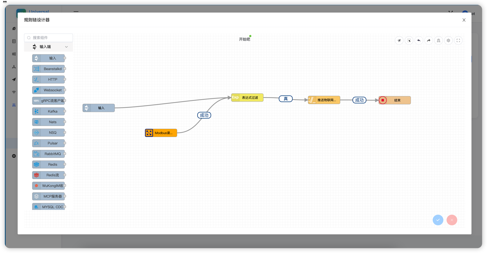
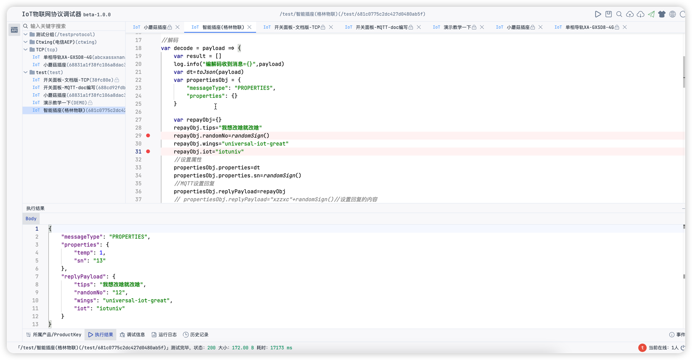

# 🚀 NexIoT物联网平台

<div align="center">


## 一款基于Java技术栈构建的"零代码侵入"企业级物联网平台

[📖 文档地址](https://nexiotplatform.github.io/universal-iot-docs/) | [🌐 在线演示](http://iot.192886.xyz:81/) | [🔧 调试IDE](http://iot.192886.xyz:81/magic/debug/index.html)

</div>

## 📋 目录

- [✨ 平台简介](#-平台简介)
- [🌟 平台亮点](#-平台亮点)
- [🚀 快速开始](#-快速开始)
- [📦 运行部署](#-运行部署)
- [🎯 核心功能](#-核心功能)
- [🏗️ 技术架构](#️-技术架构)
- [📈 正在推进](#-正在推进)
- [💡 最佳实践](#-最佳实践)
- [🎥 视频教程](#-视频教程)
- [📸 界面展示](#-界面展示)
- [🤝 贡献指南](#-贡献指南)
- [📄 开源协议](#-开源协议)

## ✨ 平台简介

NexIoT IoT
是一款基于Java技术栈构建的“零代码侵入”企业级物联网平台，具备高内聚低耦合，零代码侵入。平台集成了云调试功能，支持TCP、MQTT、天翼物联、HTTP等多种协议的统一管理，提供完整的产品定义、物模型设计、设备接入、北向应用输出、规则引擎等核心功能，为物联网应用提供一站式解决方案；完整开源、导入即可运行！

## 🌟 平台亮点

- ✅ **低成本对接**：接入一款设备在`外置调试器`完成，不用`改`系统任何代码，无代码侵入，`大学生`就能完成。
- ✅ **模块化**：TCP、MQTT、天翼物联等按需开启，对接一个新平台太容易了
- ✅ **没有标准化应对各种标准**：国内行业的协议现状，不再搞标准，主打应对各种标准接入，看着很复杂无头绪，上手用起来很舒服
- ✅ **强大的协议调试器**：基于浏览器的实时协议开发和调试，直连设备接入已经半年多没重启过。
- ✅ **极简架构**：Java21、mysql5.7+、redis、MQTT（不限emqx还是其他），轻松应付百万级别的设备;支持clickhouse存储（配置就行）

## 🚀 快速开始

### 📋 环境要求

- **JDK**: 21+
- **MySQL**: 5.7+
- **Redis**: 6.0+
- **Maven**: 3.9+

### 🎯 演示地址

- **管理后台**: <http://iot.192886.xyz:81/>
- **调试IDE**: <http://iot.192886.xyz:81/magic/debug/index.html>
- **演示账号**: test/Haha@2025
- **文档地址**: <https://nexiotplatform.github.io/universal-iot-docs/>
- **文档地址(国内)**: <http://docs.192886.xyz:81/>

## 📦 运行部署

### 🖥️ 本地部署

```bash
# 1. 修改配置文件
vim cn-universal-web/src/main/resources/application-{dev}.properties

# 2. 配置数据库、redis、emqx
spring:
  datasource:
    url: jdbc:mysql://localhost:3306/universal_iot?useUnicode=true&characterEncoding=utf8&zeroDateTimeBehavior=convertToNull&useSSL=true&serverTimezone=GMT%2B8
    username: root
    password: 123456

# 3. 启动应用
mvn spring-boot:run
```

### ☁️ 生产环境部署

```bash
# 1. 打包应用
mvn clean package -DskipTests -PProd

# 2. 上传到服务器
scp cn-universal-web/target/cn-universal-web.tar.gz root@your-server:/opt/nexiot/

# 3. 启动服务
tar -zxvf cn-universal-web.tar.gz

cd cn-universal-web & ./bin/restart.sh

```

## 🎯 核心功能

### 🚀 设备接入能力

- ✅ **TCP设备接入**：16进制报文传输、协议解析、云调试、在线测试
- ✅ **MQTT设备接入**：物模型/透传模式、云调试、在线测试、支持EMQX/HiveMQ等
- ✅ **HTTP设备接入**：REST API、Java SDK、OAuth2认证、完整接口规范
- ✅ **天翼物联接入**：设备注册、数据上报、指令下发、标准协议对接
- ✅ **云云对接接入**：已支持，具备完整的SDK和API，支持多平台数据同步、协议转换

### 🎯 核心管理功能

- ✅ **产品管理**：多协议产品创建、物模型定义、产品标签、公共配置
- ✅ **协议管理**：云调试环境、插件化架构、实时协议开发、统一管理平台
- ✅ **设备管理**：设备详情监控、在线指令下发、设备影子、消息订阅、日志查看
- ✅ **网络组件**：TCP/MQTT服务管理、启动/暂停/禁用操作、个性化参数配置
- ✅ **应用管理**：北向应用输出、OAuth2 API SDK、设备绑定、推送配置
- ✅ **通知管理**：多渠道支持（钉钉、阿里云、腾讯云、webhook、邮箱、飞书）
- ✅ **场景联动**：基于设备属性/事件的触发规则、多动作执行、实时自动化
- 🔄 **RuleGO规则引擎**：可视化规则引擎执行、支持OPCUA、Moudbus工业场景

### 📊 协议接入现状

| 协议类型       | 状态    | 核心功能                              |
|------------|-------|-----------------------------------|
| **TCP设备**  | ✅ 已实现 | 16进制报文传输、协议解析、云调试、在线测试            |
| **MQTT设备** | ✅ 已实现 | 物模型/透传模式、云调试、在线测试、支持EMQX/HiveMQ等  |
| **HTTP设备** | ✅ 已实现 | REST API、Java SDK、OAuth2认证、完整接口规范 |
| **天翼物联**   | ✅ 已实现 | 完整的产品创建设备注册、数据上报、指令下发、标准协议对接      |
| **云云对接**   | ✅ 已支持 | Java SDK 自行扩展协议模块                 |

## 🏗️ 技术架构

### 🛠️ 技术栈

- **后端框架**：`Java 21` `SpringBoot 3.5` `Tk.Mybatis 5.0.1`
- **数据存储**：MySQL5.7+ / Redis / ClickHouse（可选）
- **架构模式**：单体架构设计，支持微服务化部署
- **前端技术**：基于`RuoYi-Antdv`构建，感谢开源社区！

### 🏛️ 系统架构

```text
┌─────────────────┐    ┌─────────────────┐    ┌─────────────────┐
│   设备接入层      │    │   协议处理层      │    │   业务服务层      │
│                │    │                │    │                │
│ • TCP Server    │───▶│ • 协议解析       │───▶│ • 设备管理       │
│ • MQTT Broker   │    │ • 数据转换       │    │ • 产品管理       │
│ • HTTP API      │    │ • 消息路由       │    │ • 规则引擎       │
│ • 天翼物联        │    │ • 云调试        │    │ • 通知服务       │
└─────────────────┘    └─────────────────┘    └─────────────────┘
         │                       │                       │
         ▼                       ▼                       ▼
┌─────────────────┐    ┌─────────────────┐    ┌─────────────────┐
│   数据存储层      │    │   缓存层         │    │   外部接口层      │
│                │    │                │    │                │
│ • MySQL         │    │ • Redis         │    │ • 北向API       │
│ • ClickHouse    │    │ • 本地缓存       │    │ • Webhook       │
│ • 时序数据        │    │ • 会话管理       │    │ • 第三方集成     │
└─────────────────┘    └─────────────────┘    └─────────────────┘
```

## 📈 正在推进

- **🔄 小程序**：付费图鸟定制UI，具备指令控制、属性、告警查看，轻量化、多管理员
- **🔄 时序数据库**：在clickhouse基础上增加iotdb
- **🔄 其他**：也可以提一些意见


## 💡 最佳实践

### 我在1688自费购入了两款设备（NB水浸、4G电表），通过电信AEP与TCP直连。将围绕典型接入方式，发布视频和教程。以过来人的经验，单看文档不如对照实物从0到1动手实践更高效，你在实际操作中会有更多收获

### 当然你也可以购买与作者同款设备进行学习，另外请注意用电安全

|                              |                              |                             |
|------------------------------|------------------------------|-----------------------------|
|  |  |  |

## 🎥 视频教程

我们提供了详细的视频教程，帮助您快速上手NexIoT平台。所有教程都是基于真实设备进行实战演示。

### 📡 天翼物联接入教程

#### 🌊 NB水浸传感器系列

1. **【手把手实战：水浸传感器开箱：初见与硬件解析】**
    - 📺 [B站观看](https://www.bilibili.com/video/BV1kLY5z5EMH/?share_source=copy_web&vd_source=c9e1500efcc8aa0763f711fadaa68dff)
    - 📝 内容：设备开箱、硬件介绍、基本功能测试

2. **【手把手实战：NexIoT接入Ctwing参数配置】**
    - 📺 [B站观看](https://www.bilibili.com/video/BV1jVY7zVEjM/?share_source=copy_web&vd_source=c9e1500efcc8aa0763f711fadaa68dff)
    - 📝 内容：天翼物联平台参数配置、设备注册流程

3. **【手把手实战：NB水浸传感器CTWing接入全流程】**
    - 📺 [B站观看](https://www.bilibili.com/video/BV1sJaZzBEfr/?share_source=copy_web&vd_source=c9e1500efcc8aa0763f711fadaa68dff)
    - 📝 内容：完整的设备接入流程，从配置到数据上报

### 🔌 TCP直连接入教程

#### ⚡ DL/T64电表系列

1. **【NexIoT开源】手把手实战：DL/T64电表TCP直连接入】**
    - 📺 [B站观看](https://www.bilibili.com/video/BV1x4pBzZEVN/?share_source=copy_web&vd_source=c9e1500efcc8aa0763f711fadaa68dff)
    - 📝 内容：TCP协议解析、设备直连配置、数据解析

2. **【NexIoT开源】手把手实战：产品创建与SNI解读】**
    - 📺 [B站观看](https://www.bilibili.com/video/BV1zSWNzoETF/?share_source=copy_web&vd_source=c9e1500efcc8aa0763f711fadaa68dff)
    - 📝 内容：产品创建流程、SNI设备标识解析、协议调试

3. **【NexIoT开源】手把手实战：如何写TCP接入的DL/T645电表解析脚本】**
    - 📺 [B站观看](https://www.bilibili.com/video/BV1SAWVzwEZE/?share_source=copy_web&vd_source=c9e1500efcc8aa0763f711fadaa68dff)
    - 📝 内容：数据流介绍、调试IDE的编写和调试、645电表的编写


### 🎯 更多教程

我们正在持续制作更多设备的接入教程，尽情期待。非常希望得到您的建议！

## 📸 界面展示

### 🏗️ 架构图


### 🚀 部署图


### 🖥️ 功能截图

#### 🌐 直接使用天翼产品


#### 🔄 流程编排



#### 🛠️ 协议统一管理与IDE（推荐）




|                              |                              |                             |
|------------------------------|------------------------------|-----------------------------|
||  ||
||  ||
||  ||
||  ||
||  ||
||  ||
||  ||
||  ||
||  ||

### 🧪 案例展示


某大型公司，企业物联网平台，主服务器8核32G，接入TCP直连5万、低功耗传感器（烟感、水浸、温湿度的等）10万，监控1万，平台QPS500，服务器五年无重大故障。用于智慧用电、智慧交通农业场景。


## 🤝 贡献指南

我们欢迎所有形式的贡献！无论是代码、文档、问题反馈还是功能建议。

### 🚀 如何贡献

1. **Fork 项目**

   ```bash
   # 点击右上角 Fork 按钮
   ```

2. **创建分支**

   ```bash
   git checkout -b feature/your-feature-name
   ```

3. **提交代码**

   ```bash
   git add .
   git commit -m "feat: add your feature"
   git push origin feature/your-feature-name
   ```

4. **创建 Pull Request**
    - 在 Gitee 上创建 Pull Request
    - 详细描述你的修改内容
    - 等待代码审查

### 📝 代码规范

- 遵循 Java 编码规范
- 添加必要的注释和文档
- 确保代码通过所有测试
- 提交信息使用 [Conventional Commits](https://www.conventionalcommits.org/) 格式

### 🐛 问题反馈

- 使用 [Issues](https://gitee.com/nexiotplatform/Universal-IoT-Java/issues) 报告 Bug
- 提供详细的问题描述和复现步骤
- 包含系统环境信息

### 💡 功能建议

- 在 Issues 中提出新功能建议
- 详细描述功能需求和预期效果
- 欢迎讨论技术实现方案

## 📄 开源协议

### 📋 协议说明

开源版本采用 **AGPL3.0** 协议，可用于个人学习和使用，商业用途需赞助项目，获得授权。

二开项目同样遵守 AGPL3.0 协议进行开源，可以向原作者申请授权。

大学生毕设项目免费使用

### 📜 授权说明

1. **授权用户可无限期在其内部使用**
    - 企业授权用户不含分公司、子公司及第三方公司
    - 个人授权用户仅可个人使用，不可用于在职公司或任何第三方

2. **授权用户不可向第三方发行或转让授权源码**
    - 无论有偿或无偿
    - 不可申请包含本项目的授权源码的软件著作权
    - 用户可申请自主二次研发部分源码的软件著作权

3. **授权用户仅可通过项目形式进行源码的二次开发**
    - 完成的定制化软件必须加密打包后才可交付客户
    - 如需交付项目源码，必须为客户购买对应的商业授权

### 🔒 开源和商业

开源版本暂不包含 **TCP**、**天翼物联ctaiot** 模块。可自行二次开发扩展，商业用途需赞助项目，获得授权。

### 🙏 致谢

感谢以下开源项目和技术平台：

- **开源框架**：若依、Antdv、jetlink、ssssssss-team
- **云平台**：阿里云、华为云、腾讯云、AEP、OneNet 等物联网平台
- **社区支持**：所有贡献者和用户的支持与反馈
