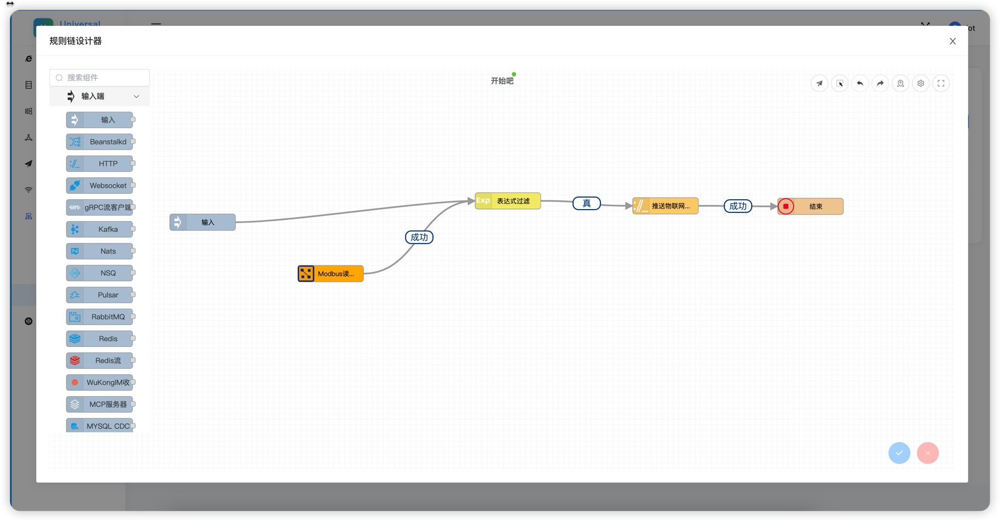
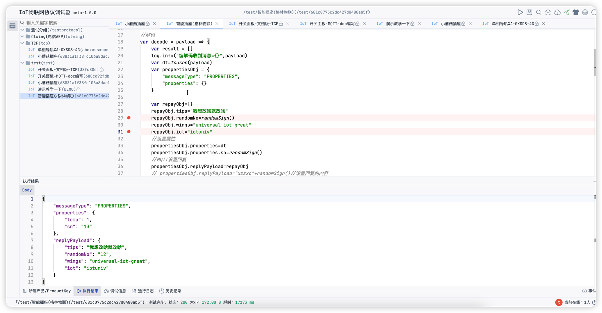

# Universal IoT 物联网平台

### 各位大佬，熬夜开源不易，点个star，进群获取db文件！！

#### 文档地址：https://nexiotplatform.github.io/universal-iot-docs/

#### 演示地址（最新代码）：http://iot.192886.xyz:81/  

账号密码：test/Haha@2025

#### 调试IDE：http://iot.192886.xyz:81/magic/debug/index.html    

账号密码：test/Haha@2025

乱删除数据、会拉黑！

#### 演示环境情况
演示环境是最新代码，是一个集群的部署情况（TCP、MQTT）
> 1个主节点（web后台管理）+ 1个火山引擎服务器节点（TCP、MQTT接入服务）+1个阿里云服务器节点（TCP、MQTT接入服务）
> 
> 全部是99元的服务器，不要大规模测试，感谢！也欢迎大佬捐赠服务器资源
> 
> 有希望在演示环境做对接测试验证的，请提前私信，我尽力提高最大的技术支持

## 平台简介

Universal IoT
是一款基于Java技术栈构建的企业级物联网平台，具备高度灵活性和可扩展性。平台集成了云调试功能，支持TCP、MQTT、天翼物联、HTTP等多种协议的统一管理，提供完整的产品定义、物模型设计、设备接入、北向应用输出、规则引擎等核心功能，为物联网应用提供一站式解决方案。

## 平台亮点

- ✅ **低成本对接**：接入一款设备在`外置调试器`完成，不用`改`系统任何代码，`大学生`就能完成
- ✅ **模块化**：TCP、MQTT、天翼物联等按需开启，对接一个新平台太容易了
- ✅ **没有标准化应对各种标准**：国内行业的协议现状，不再搞标准，主打应对各种标准接入
- ✅ **强大的协议调试器**：基于浏览器的实时协议开发和调试，直连设备接入已经半年多没重启过

## ✅ 平台功能总结

### 🚀 设备接入能力

- ✅ **TCP设备接入**：16进制报文传输、协议解析、云调试、在线测试
- ✅ **MQTT设备接入**：物模型/透传模式、云调试、在线测试、支持EMQX/HiveMQ等
- ✅ **HTTP设备接入**：REST API、Java SDK、OAuth2认证、完整接口规范
- ✅ **天翼物联接入**：设备注册、数据上报、指令下发、标准协议对接
- ✅ **云云对接接入**：已支持，具备完整的SDK和API，支持多平台数据同步、协议转换

### 🎯 核心管理功能

- ✅ **产品管理**：多协议产品创建、物模型定义、产品标签、公共配置
- ✅ **协议管理**：云调试环境、插件化架构、实时协议开发、统一管理平台
- ✅ **设备管理**：设备详情监控、在线指令下发、设备影子、消息订阅、日志查看
- ✅ **网络组件**：TCP/MQTT服务管理、启动/暂停/禁用操作、个性化参数配置
- ✅ **应用管理**：北向应用输出、OAuth2 API SDK、设备绑定、推送配置
- ✅ **通知管理**：多渠道支持（钉钉、阿里云、腾讯云、webhook、邮箱、飞书）
- ✅ **场景联动**：基于设备属性/事件的触发规则、多动作执行、实时自动化
- 🔄 **RuleGO规则引擎**：可视化规则引擎执行、支持OPCUA、Moudbus工业场景

## 核心功能

### 🚀 协议接入现状

| 协议类型       | 状态    | 核心功能                              |
|------------|-------|-----------------------------------|
| **TCP设备**  | ✅ 已实现 | 16进制报文传输、协议解析、云调试、在线测试            |
| **MQTT设备** | ✅ 已实现 | 物模型/透传模式、云调试、在线测试、支持EMQX/HiveMQ等  |
| **HTTP设备** | ✅ 已实现 | REST API、Java SDK、OAuth2认证、完整接口规范 |
| **天翼物联**   | ✅ 已实现 | 完整的产品创建设备注册、数据上报、指令下发、标准协议对接      |
| **云云对接**   | ✅ 已支持 | Java SDK 自行扩展协议模块                 |

## 技术架构

- **后端框架**：`Java 21` `SpringBoot 3.5` `Tk.Mybatis 5.0.1`
- **数据存储**：MySQL5.7+ / Redis
- **架构模式**：单体架构设计，支持微服务化部署
- **前端技术**：基于`RuoYi-Antdv`构建，感谢开源社区！

## 后续计划

- **🔄小程序开发**：正在定制UI，具备指令控制、属性、、告警查看
- **🔄扩展推送**：MQTT / RoekcetMQ / DB /Kafka
- **🔄其他**：请建议！

## 最佳实践

#### 我在1688自费购入了两款设备（NB水浸、4G电表），通过电信AEP与TCP直连。将围绕典型接入方式，发布视频和教程。以过来人的经验，单看文档不如对照实物从0到1动手实践更高效，你在实际操作中会有更多收获。

#### 你也可以购买同款设备进行学习，另外请注意用电安全。

|                              |                              |                             |
|------------------------------|------------------------------|-----------------------------|
|  |  |  |

## 界面展示

### 架构图

### 部署图

### 功能截图

#### 直接使用天翼产品

#### 流程编排

#### 协议统一管理与IDE（推荐）

|                            |                            |                            |
|----------------------------|----------------------------|----------------------------|
|  |  |  |
|  |  |  |
|  |  |  |
|  |  |  |
|  |  |  |
|  |  |  |
|  |  |  |
|  |  |  |

|                            |                            |                            | 
|----------------------------|----------------------------|----------------------------|
|  |  |  | 

### 强大调试器

|                                     |                                     |                                   |
|-------------------------------------|-------------------------------------|-----------------------------------|
|  |  |  |

有任何问题加入QQ群

| 在线沟通                       |                            | 
|----------------------------|----------------------------|
|  |  | 

### 商用授权

开源版本采用AGPL3协议，可用于个人学习和使用，，商业用途需要赞助项目，获得授权。二开项目同样遵守AGPL3.0协议进行开源，可以向原作者申请授权。

授权说明：
1、授权用户可无限期在其内部使用（企业授权用户不含分公司、子公司及第三方公司）（个人授权用户仅可个人使用，不可用于在职公司或任何第三方）。
3、授权用户不可向第三方发行或转让授权源码，无论有偿或无偿，也不可申请包含本项目的授权源码的软件著作权。用户可申请自主二次研发部分源码的软件著作权。
4、授权用户仅可通过项目形式进行源码的二次开发，完成的定制化软件必须加密打包后才可交付客户。如需交付项目源码，必须为客户购买对应的商业授权。

### 开源和商业

开源版本暂不包含TCP和天翼物联模块，可自行二次开发扩展，商用授权需获取授权

### 参考项目

若依、Antdv、jetlink、ssssssss-team 开源软件，阿里云、华为云、腾讯云、AEP和OneNet等物联网平台