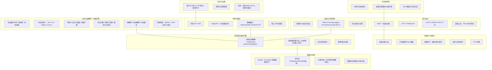

## 平台整体能力图

```mermaid
graph TB
  %% 能力域视图
  subgraph "接入能力"
    IA1["MQTT（系统必备）"]
    IA2["HTTP / WebSocket"]
    IA3["CoAP / LwM2M / NB-IoT / 4G"]
    IA4["设备认证：Token/证书/签名"]
  end

  subgraph "协议与编解码（外置引擎）"
    PC1["协议插件市场 / 热更新 / 动态加载"]
    PC2["多语言执行：Java / JS / Magic / Groovy"]
    PC3["内置 & 自定义函数 / 类型扩展"]
    PC4["安全沙箱 / 多租户权限 / 版本化与灰度"]
    PC5["编解码 & 反编解码 / 在线调试"]
    PC6["存储适配：MySQL / OSS / 自定义实现"]
  end

  subgraph "设备与产品能力"
    DP1["设备注册/认证"]
    DP2["产品/模型/Topic 模板"]
    DP3["设备影子：属性/服务/事件"]
    DP4["拓扑/分组/标签"]
    DP5["OTA 管理"]
  end

  subgraph "流处理与规则引擎"
    RE1["消息总线解耦（Kafka/Redis Streams/RabbitMQ）"]
    RE2["规则编排/算子库（过滤/聚合/窗口/异常）"]
    RE3["派生指标/事件"]
    RE4["幂等/重试/容错"]
  end

  subgraph "数据与存储"
    DS1["MySQL（tk.mybatis 管理配置/资产）"]
    DS2["时序库（TDengine/InfluxDB/可插拔）"]
    DS3["对象存储（文件/固件/编解码包）"]
    DS4["数据生命周期与冷热分层"]
  end

  subgraph "开放与集成"
    OP1["开放 API / SDK"]
    OP2["MagicAPI（Jar 配置启用）"]
    OP3["数据推送：Webhook/MQTT/Kafka/HTTP"]
    OP4["第三方平台适配"]
  end

  subgraph "安全与治理"
    SG1["租户与 RBAC / API 网关 / 限流审计"]
    SG2["密钥与凭据管理"]
    SG3["合规：禁用 Redis KEYS，使用扫描/流"]
  end

  subgraph "运维与可观测性"
    OM1["配置中心/灰度/回滚"]
    OM2["Metrics/Tracing/Logging（Prometheus/Grafana/ELK）"]
    OM3["任务调度与告警"]
  end

  subgraph "开发者体验"
    DX1["示例与文档/规范"]
    DX2["设备仿真/脚本/沙盒环境"]
    DX3["Topic 模板与代码生成"]
  end

  IA1 --- DP1
  PC5 --- RE1
  RE2 --- DS2
  OP3 --- RE1
  SG1 --- OP1
  OM2 --- RE1
  DX2 --- IA1
```

