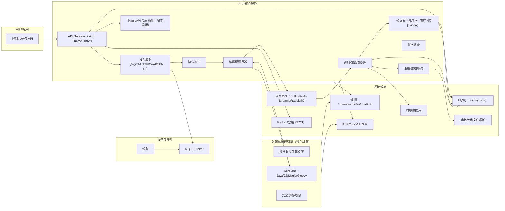

## 部署视图

```mermaid
graph LR
  %% 部署视图（逻辑组件与基础设施）
  subgraph Users["用户/应用"]
    U1["控制台/开放API"]
  end

  subgraph Edge["设备与外部"]
    DEV["设备"]
    BROKER["MQTT Broker"]
  end

  subgraph Core["平台核心服务"]
    GW["API Gateway + Auth (RBAC/Tenant)"]
    ACCESS["接入服务（MQTT/HTTP/CoAP/NB-IoT）"]
    ROUTER["协议路由"]
    INV["编解码调用器"]
    RULE["规则引擎/流处理"]
    TWIN["设备与产品服务（影子/拓扑/OTA）"]
    PUSH["推送/集成服务"]
    JOB["任务调度"]
    MAGIC["MagicAPI (Jar 插件，配置启用)"]
  end

  subgraph Codec["外置编解码引擎（独立部署）"]
    CREG["插件管理与包仓库"]
    CEXEC["执行引擎：Java/JS/Magic/Groovy"]
    CSAN["安全沙箱/权限"]
  end

  subgraph Infra["基础设施"]
    MYSQL["MySQL（tk.mybatis）"]
    BUS["消息总线：Kafka/Redis Streams/RabbitMQ"]
    REDIS["Redis（禁用 KEYS）"]
    TSDB["时序数据库"]
    OSS["对象存储/文件/固件"]
    OBS["观测：Prometheus/Grafana/ELK"]
    CONF["配置中心/注册发现"]
  end

  U1 --> GW
  GW --> MAGIC
  GW --> ACCESS
  ACCESS --> BROKER
  DEV --> BROKER
  ACCESS --> ROUTER
  ROUTER --> INV
  INV --> CEXEC
  CEXEC --> INV
  INV --> BUS
  BUS --> RULE
  RULE --> TWIN
  RULE --> PUSH
  RULE --> TSDB
  RULE --> MYSQL
  TWIN --> MYSQL
  PUSH --> OSS

  GW --> MYSQL
  GW --> REDIS
  Core --> OBS
  Codec --> OBS
  Core --> CONF
  Codec --> CONF
```

