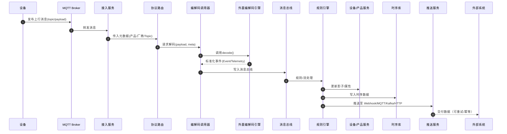

## 上行数据流（时序）

```mermaid
sequenceDiagram
  autonumber
  participant D as 设备
  participant B as MQTT Broker
  participant A as 接入服务
  participant R as 协议路由
  participant I as 编解码调用器
  participant E as 外置编解码引擎
  participant K as 消息总线
  participant Q as 规则引擎
  participant T as 设备/产品服务
  participant S as 时序库
  participant P as 推送服务

  D->>B: 发布上行消息(topic/payload)
  B->>A: 转发消息
  A->>R: 传入元数据(产品/厂商/Topic)
  R->>I: 请求解码(payload, meta)
  I->>E: 调用decode()
  E-->>I: 标准化事件(Event/Telemetry)
  I->>K: 写入消息总线
  K->>Q: 规则/流处理
  Q->>T: 更新影子/属性
  Q->>S: 写入时序数据
  Q->>P: 推送至 Webhook/MQTT/Kafka/HTTP
  P-->>外部系统: 交付数据（可重试/幂等）
```

