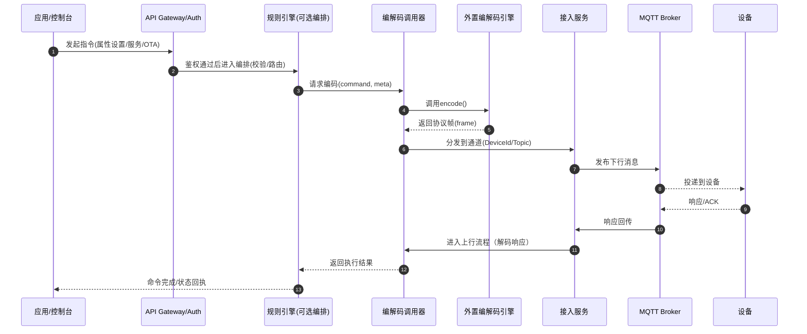

## 下行数据流（时序）

```mermaid
sequenceDiagram
  autonumber
  participant U as 应用/控制台
  participant G as API Gateway/Auth
  participant Q as 规则引擎(可选编排)
  participant I as 编解码调用器
  participant E as 外置编解码引擎
  participant A as 接入服务
  participant B as MQTT Broker
  participant D as 设备

  U->>G: 发起指令(属性设置/服务/OTA)
  G->>Q: 鉴权通过后进入编排(校验/路由)
  Q->>I: 请求编码(command, meta)
  I->>E: 调用encode()
  E-->>I: 返回协议帧(frame)
  I->>A: 分发到通道(DeviceId/Topic)
  A->>B: 发布下行消息
  B-->>D: 投递到设备
  D-->>B: 响应/ACK
  B->>A: 响应回传
  A->>I: 进入上行流程（解码响应）
  I-->>Q: 返回执行结果
  Q-->>U: 命令完成/状态回执
```

